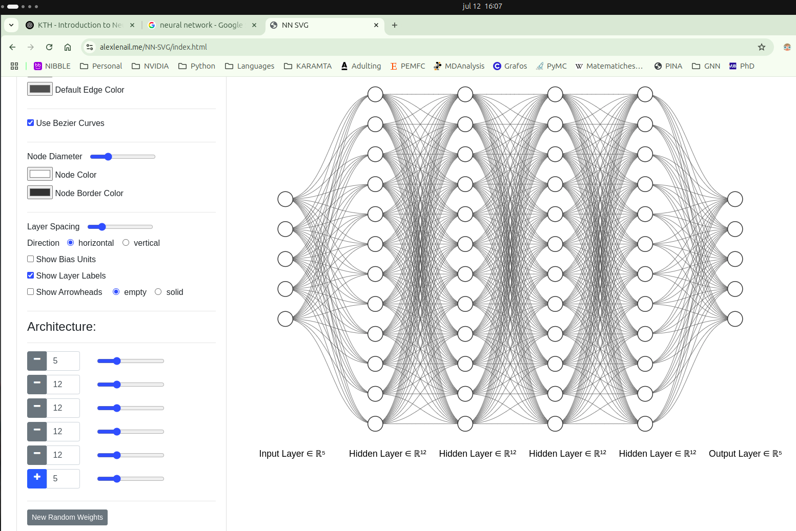

# My-Notes-on-PINNs

### USEFUL RESOURCES

* [HTML edition of The Feynman Lectures on Physics](https://www.feynmanlectures.caltech.edu/), published by the California Institute of Technology.
  * [Lecture 19](https://www.feynmanlectures.caltech.edu/II_19.html): The Principle of Least Action.     

* [Here](https://alexlenail.me/NN-SVG/index.html) you can easily draw a neural network. For Instance:

   

* [TensorFlow's Playground](https://playground.tensorflow.org/)

